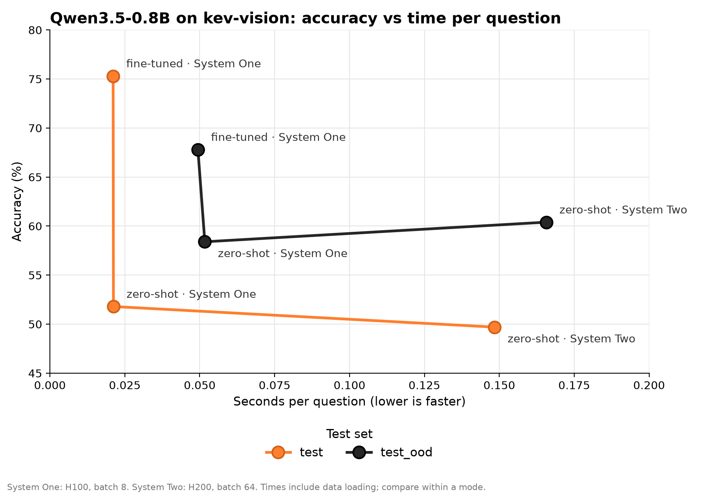

# IMA: Instant Multimodal Answers

A fast decision model built on a pretrained multimodal LLM (Hugging Face).
It answers typed questions about a state (text and images) in one forward
pass per question, with no text generation. It reads the probabilities from
the logits of the option letters (A, B, C, ...).

This is the "System One" model: fast, one shot. For comparison, the project
also has a "System Two" test mode, where the same LLM generates its answer
like a chat model.

## How it works
1. Each question becomes a lettered prompt: images, state, question, options
   (`A. ...`, `B. ...`) and a request to answer with the letter only.
2. The backbone runs one forward pass. Only the logits of the option letters
   at the answer position are kept.
3. A softmax with a global temperature turns them into one probability per
   option. The temperature is fitted after training (calibration).

Question types:
- `noul`: yes or no, returns the probability of "yes"
- `choice`: one option out of many, returns the best option, a confidence
  and the probability of each option
- `score`: ordered levels, returns the expected level, a confidence and the
  probability of each level

Up to 26 options per question (letters A-Z).

## Install
Needs Python 3.11+ and [uv](https://docs.astral.sh/uv/).

```bash
uv sync
```

On CUDA, `flash-linear-attention` makes the Qwen3.5/3.8 linear attention
fast. Without CUDA (e.g. macOS) a slower PyTorch fallback is used.

The training dataset (`Jacqkues/kev-vision-decisions-full`) is gated, so log
in first with `hf auth login`.

## Usage

### Inference
The pipeline takes a `/v1/systemone` request and returns the typed answers.

```python
from src.pipeline.system_one import SystemOnePipeline

# a trained model, or a raw backbone id for zero-shot answers
pipeline = SystemOnePipeline.from_pretrained("runs/qwen3_5_0_8b/final")
response = pipeline({
    "state": "A customer writes: 'I was charged twice this month.'",
    "media": [],
    "questions": {
        "billing": {"type": "noul", "instructions": "Is it about billing?"},
        "tone": {
            "type": "choice",
            "instructions": "What is the tone?",
            "criteria": {"calm": None, "angry": None, "sad": None},
        },
    },
})
# {"model": ..., "answers": {"billing": {"type": "noul", "noul": <p_yes>},
#  "tone": {"type": "choice", "choice": "angry", ...}}, "usage": {...}}
```

### Train, calibrate, test
Each task reads a YAML config. You can change any value from the command
line with `--key value` or `--section.key value`.

```bash
# LoRA training (calibrates at the end if the config has `calibration`)
uv run python -m src.training.train configs/train/qwen3_5_0_8b.yml

# calibrate a saved model again, standalone (e.g. after quantization)
uv run python -m src.calibration.calibrate configs/calibration/qwen3_5_0_8b.yml

# test a trained model or a raw backbone; prints and saves the metrics
uv run python -m src.testing.test configs/test/qwen3_5_0_8b.yml

# same test in System Two mode (generated answer)
uv run python -m src.testing.test configs/test/qwen3_5_0_8b_system_two.yml
```

Example override:

```bash
uv run python -m src.training.train configs/train/qwen3_5_0_8b.yml --training.learning_rate 5e-5 --data.train "train[:1000]"
```

- Training: LoRA on the linear layers of the language model. The vision
  tower and `lm_head` stay frozen. The merged model goes to
  `<output_dir>/final`.
- Calibration: fits one temperature on a part of the training records that
  is kept out of training. Only the model's `config.json` changes.
- Testing: reports accuracy, Brier score, expected calibration error (ECE),
  loss and seconds per question. System Two also reports the share of
  outputs with no valid answer.

### Modal (cloud GPUs)
The same tasks run on [Modal](https://modal.com). This needs `modal setup`
and a Secret `huggingface` with `HF_TOKEN`.

```bash
modal secret create huggingface HF_TOKEN=<token>

# download the backbone and dataset once, into persistent Volumes
modal run src/modal/app.py --task cache --config configs/train/qwen3_8_27b.yml

# train (keeps running if you close the terminal)
modal run --detach src/modal/app.py --task train --config configs/train/qwen3_8_27b.yml

# calibrate or test
modal run src/modal/app.py --task test --config configs/test/qwen3_8_27b.yml

# TensorBoard on the training logs (prints the URL)
modal deploy src/modal/tensorboard_app.py
```

The GPU comes from the config's `modal.gpu` (default H200). `--gpu` wins over
it, and `--overrides "..."` passes config overrides.

## Configs
- `configs/train/`: training runs (`backbone`, `seed`, `lora`, `data`,
  `training`, optional `calibration`)
- `configs/calibration/`: standalone calibration (`model`, `seed`, `data`,
  `calibration`, `calibrating`)
- `configs/test/`: test runs (`model`, optional `temperature`, `data`,
  `testing`, optional `system_two`)

The `training`, `calibrating` and `testing` sections take any Hugging Face
`TrainingArguments` key.

## Project layout
```
src/
  model/        System One and System Two models, config, loader
  common/       request parsing, question types, prompt, config parser
  data/         dataset, collator, Hub loader
  pipeline/     inference pipeline (/v1/systemone)
  evaluation/   evaluator and metrics
  training/     LoRA training
  calibration/  temperature calibration
  testing/      test script
  modal/        Modal apps (tasks and TensorBoard)
configs/        YAML run configs
```

## Results
Qwen3.5-0.8B on `Jacqkues/kev-vision-decisions-full`:

| Model | Mode | Test set | Accuracy | Brier | ECE |
|---|---|---|---|---|---|
| zero-shot | System Two | `test` | 49.7% | 0.623 | 0.266 |
| zero-shot | System One | `test` | 51.8% | 0.512 | 0.104 |
| fine-tuned | System One | `test` | 75.3% | 0.262 | 0.029 |
| zero-shot | System Two | `test_ood` | 60.4% | 0.477 | 0.143 |
| zero-shot | System One | `test_ood` | 58.4% | 0.505 | 0.051 |
| fine-tuned | System One | `test_ood` | 67.8% | 0.414 | 0.035 |

`test_ood` holds sources not seen in training.

Accuracy against time per question:



## Limits
- Max 26 options per question.
- One GPU only, no multi-GPU training yet.
- Images only, no video.
- Each question of a request is a separate forward pass (no shared KV cache).
